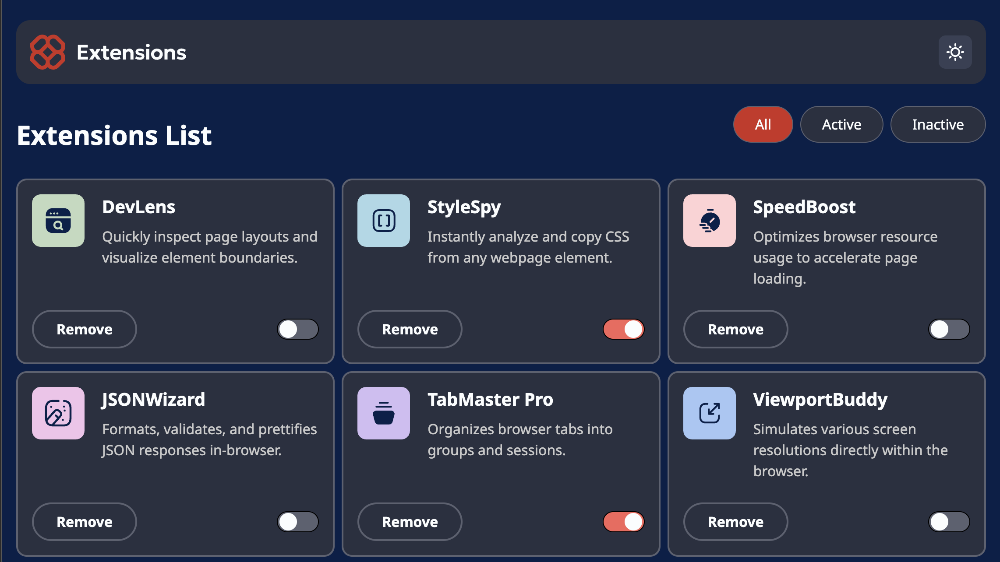

# Frontend Mentor - Browser extensions manager UI solution

This is a solution to the [Browser extensions manager UI challenge on Frontend Mentor](https://www.frontendmentor.io/challenges/browser-extension-manager-ui-yNZnOfsMAp). Frontend Mentor challenges help you improve your coding skills by building realistic projects.

## Table of contents

- [Overview](#overview)
  - [The challenge](#the-challenge)
  - [Screenshot](#screenshot)
  - [Links](#links)
- [My process](#my-process)
  - [Built with](#built-with)
  - [What I learned](#what-i-learned)
- [Author](#author)

## Overview

### The challenge

Users should be able to:

- Toggle extensions between active and inactive states
- Filter active and inactive extensions
- Remove extensions from the list
- Select their color theme
- View the optimal layout for the interface depending on their device's screen size
- See hover and focus states for all interactive elements on the page

### Screenshot

### Links

- Solution URL: [GitHub](https://github.com/piyush-kaushik24/browser-extensions-manager-ui)
- Live Site URL: [Browser extensions manager UI ](https://browser-extensions-manager-ui-nine.vercel.app/)

## My process

- Switching themes with React state and updating the `<html>` element with `data-theme`
- Using `useEffect` for DOM side effects
- Using functional state updates with `prev` when the new state depends on the current state
- Building Active, Inactive, and All filters with `filter()`
- Using union types for controlled filter values such as `"all"`, `"active"`, and `"inactive"`
- Using CSS custom properties and semantic color tokens for light and dark themes

### Built with

- Semantic HTML5 markup
- CSS custom properties
- Flexbox
- CSS Grid
- Mobile-first workflow
- [TypeScript](https://www.typescriptlang.org/)
- [React](https://react.dev/) - JS library
- [Tailwind CSS](https://tailwindcss.com/) - CSS framework

### What I learned

## Author

- GitHub - [@piyush-kaushik24](https://github.com/piyush-kaushik24)
- Frontend Mentor - [@piyush-kaushik24](https://www.frontendmentor.io/profile/piyush-kaushik24)
